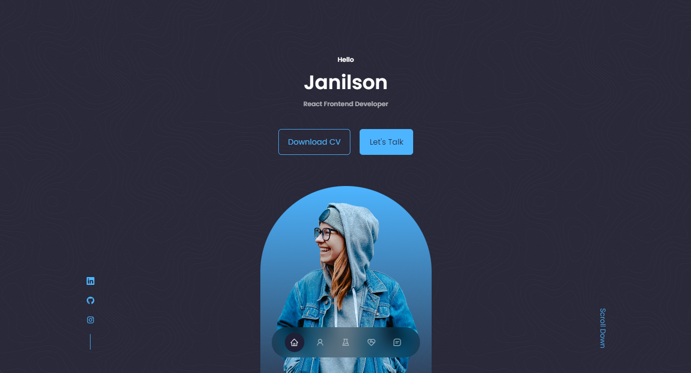

## Minimal Portfolio  [(Free version)]

> Free React Portfolio made with HTML, CSS & components React.

| [Minimal Free](https://minimal-kit-react.vercel.app/) |
|-------------------------------------------------------|
| **React**                                             |
| ✓ HTML                                                |
| ✓ CSS                                                 |
| ✓ JSX                                                 |
| ✓ Components                                          |
| ✓ React-icons                                         |
| ✓ Swiperjs                                            |

## Getting started

- Recommended `node js 16.x` and `npm 6+`. (suggestion v16.15.0)
- Install dependencies: `npm install` / `yarn install`
- Start the project: `npm run start` / `yarn start`

## Contact 
Email: jandoliveira@icloud.com
